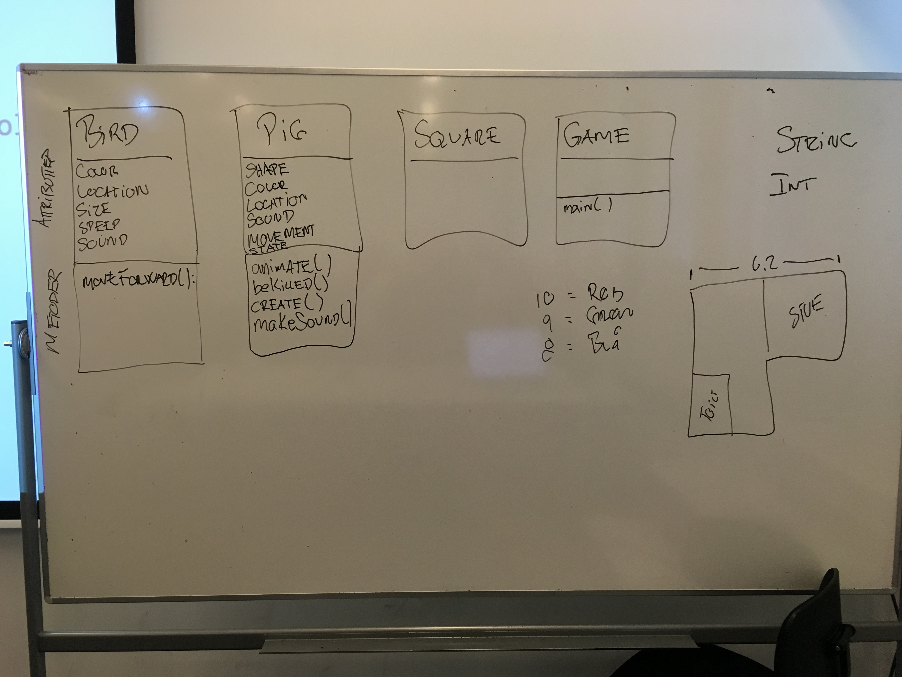

# 01_code_from_today
 Kodeeksempler fra undervisningen d. 31. august

Klasse Diagram Angry Bird

## Hvad har vi lært om indtil nu?
* Lave en klasse
* Lavet et simpelt klasse diagram
* Metoder
 * metodedeklaration
 * metodekald
* Lavet attributter til klasserne
* Attributter er navneord
* main metoden spm eksekverer programmet

